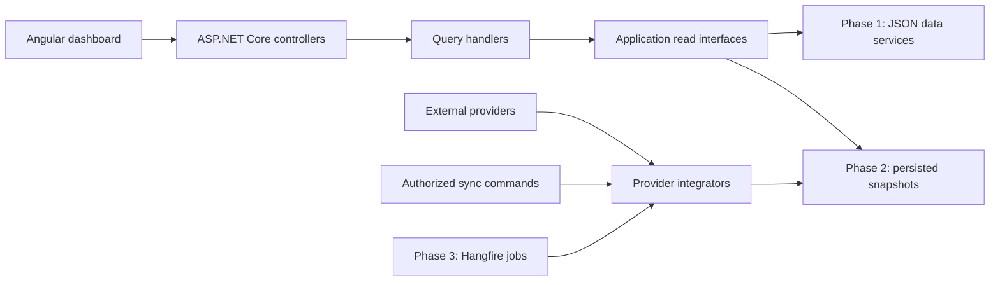

# Customer intelligence dashboard — implementation plan

Date: 2026-09-29  
Status: Milestones 1–3 are implemented as a local JSON mock. Live providers, persistence, Hangfire, and the in-app assistant remain deferred. `scripts/test.ps1` runs the xUnit assemblies directly because `dotnet test` reports that zero tests ran with this SDK. PowerShell 7 was not on PATH in the session that finished the mock, so `run.ps1` itself was not executed there; the API and UI were started with the same loopback addresses and checked in a browser.

Implementation preparation: [dependency catalog](docs/DEPENDENCIES.md), [project creation blueprint](docs/PROJECT-STRUCTURE.md), [ordered backlog and environment readiness](docs/IMPLEMENTATION-BACKLOG.md), and [AI tool instructions](docs/AI-INSTRUCTIONS.md). These are part of this plan and should be read before scaffolding. Local .NET 10, Node, npm and PowerShell runtimes have been checked; application restore/build remains to be verified during creation.

JSON preparation: [input contract and provider guides](docs/json-input/README.md). Each provider has its own Markdown example and a matching ready-to-edit JSON file. These define the loader contract to implement; there is no running loader yet.

## 1. Objective and scope

Create a reusable boilerplate for a professional customer dashboard using Angular and an ASP.NET Core API targeting .NET 10 (`net10.0`). Executives, operations teams, and account managers should be able to inspect commercial performance, usage, service commitments, requests, delivery costs, customer news, market data, account management, and customer metrics for a selected customer. Interpret the requested “marked data” as “market data” unless clarified otherwise.

**First release:** Run locally with deterministic JSON fixtures served by the API. Every tab shows data provenance and extraction time. Include loading, empty, error, partial-data, and stale-data states, plus documented PowerShell run and debug scripts.

**Following releases:** Replace fixture providers individually with Salesforce, Alexis, Jira, Confluence, and Slack integrations. Persist normalized snapshots, then add Hangfire scheduling. UI contracts should remain stable through this transition.

Assumptions that allow implementation to start:

- This is initially an internal, read-only application with a customer selector. Customer-facing access is a later deployment decision.
- A single deployable backend and one Angular application are sufficient initially.
- Fixture data is entirely fictional. Use several customers and twelve months of history.
- Start with one reporting currency per customer; do not sum currencies without an explicit exchange-rate policy.
- Alexis is a named business database/system whose schema, engine, and API availability are currently unknown.
- Jira is an additional provider, required by the requested customer-linked work view.

## 2. Recommended architecture

Use a **modular monolith with lightweight CQRS**. Controllers handle HTTP concerns, query handlers assemble dashboard responses, and provider-specific services own source access and mapping. Keep business calculations independent of controllers and external APIs.



The diagram shows successive implementations of the read interfaces; phase 1 does not require a database, worker, or Hangfire. Live browser reads eventually use stored snapshots, avoiding upstream latency and outages on each page load.

### CQRS boundaries

- Queries: `GetCustomers`, `GetCustomerOverview`, `GetCommercialSummary`, `GetUsageSummary`, `GetSlaSummary`, `GetDeliveryWork`, `GetRequestHistory`, `GetCustomerNews`, `GetMarketData`, `GetAccountSummary`, `GetCustomerMetrics`, and `GetSourceStatuses`.
- Phase 1 is read-only. Query handlers can be injected directly into controllers; a mediator package is optional and unnecessary at this size.
- Add commands when writes exist: `RequestSourceSync` and, if needed, `UpdateCustomerSourceMapping`.
- Separate read and write responsibilities in code; initially share one database when persistence arrives. Event sourcing, message brokers, distributed transactions, and separate read databases are deferred until justified.
- Command completion and data freshness are separate: accepting a sync request does not mean new data has been extracted.

Microsoft documents shared-store CQRS as a valid starting point and notes the additional complexity of event sourcing. This design adopts that smaller starting point. [CQRS guidance](https://learn.microsoft.com/en-us/azure/architecture/patterns/cqrs)

### Project layout to implement

```text
CustomerDashboard.slnx
global.json
Directory.Build.props
Directory.Packages.props
.editorconfig
src/
  CustomerDashboard.Api/             # Controllers, DI, middleware, OpenAPI, health
  CustomerDashboard.Application/     # Query/command handlers, DTOs, ports
  CustomerDashboard.Domain/          # Business types and calculation policies
  CustomerDashboard.Infrastructure/  # JSON services; later persistence/integrators
    MockData/
      customers.json
      salesforce.json
      alexis.json
      jira.json
      confluence.json
      slack.json
      customer-news.json
      market-data.json
  customer-dashboard-ui/            # Angular workspace
    src/app/
      core/                          # HTTP, configuration, authentication seam
      shared/                        # KPI, chart, provenance, state components
      features/customers/
      features/dashboard/            # Shell and dashboard tabs
        news/
        market/
        account/
        metrics/
tests/
  CustomerDashboard.UnitTests/
  CustomerDashboard.ApiTests/
  CustomerDashboard.IntegrationTests/ # Add with real adapters/persistence
  e2e/
scripts/
  setup.ps1
  run.ps1
  debug.ps1
  test.ps1
  stop.ps1
.vscode/
  launch.json
  tasks.json
docs/
  RUNNING.md
  DATA-DICTIONARY.md
  INTEGRATIONS.md
  AI-INSTRUCTIONS.md                # Tool setup and folder instruction map
  DEPENDENCIES.md                   # NuGet/npm choices and version pinning
  PROJECT-STRUCTURE.md              # Project references and configuration
  IMPLEMENTATION-BACKLOG.md         # Ordered work and readiness evidence
  json-input/                      # Shared contract and one guide per provider
.cursor/rules/                     # Root and folder-scoped Cursor adapters
AGENTS.md                          # Shared instructions / Rovo Dev project memory
CLAUDE.md                          # Claude adapter to shared instructions
README.md
PLAN.md
```

Dependency rules: Domain references no other application project. Application references Domain. Infrastructure implements Application interfaces and can reference Domain. API calls Application and references Infrastructure only to compose dependencies. Domain starts small; avoid empty layers filled with speculative abstractions.

Each project/concern folder contains an `AGENTS.md` with local responsibilities and a `CLAUDE.md` adapter. Cursor rules reference the same local instructions using path globs. These instruction files and their containing folders are created with this planning deliverable; application files shown above remain planned. See section 14 and `docs/AI-INSTRUCTIONS.md`.

## 3. Applying OOP, SOLID, DRY, and YAGNI

These are design principles, applied during implementation and code review.

| Principle | Concrete application |
| --- | --- |
| OOP | Encapsulate money/currency, reporting periods, source identity, and calculation rules. Prefer composition over inheritance. |
| Single responsibility | Controllers handle transport; handlers orchestrate; calculation policies compute; integrators fetch/map. |
| Open/closed | Swap JSON and persistent implementations through dependency injection without editing controllers or UI components. |
| Liskov substitution | Mock and live-backed read services obey the same missing-data, filtering, cancellation, and timestamp semantics. |
| Interface segregation | Use narrow source/read interfaces; do not force every source to implement revenue, usage, and SLA methods. |
| Dependency inversion | Application owns interfaces such as `ICommercialDataReader`; infrastructure supplies implementations. |
| DRY | Share actual repeated formatting, provenance, error rendering, and business rules. Calculate metrics once on the backend. |
| YAGNI | No generic repository framework, universal connector engine, plugin loader, event sourcing, or microservices in phase 1. |

Suggested source services: `SalesforceDataService`, `AlexisDataService`, `JiraDataService`, `ConfluenceDataService`, and `SlackDataService`, initially backed by source-specific JSON. Use typed results rather than dictionaries of arbitrary values. Add `ISalesforceIntegrator` and similar narrow ingestion interfaces only as live integrations are implemented.

## 4. UI experience

Create a polished, responsive Angular application using standalone components, strict TypeScript, route-level lazy loading, and signals for local view state. Use Angular Material/CDK for controls and accessibility, and a chart library such as Apache ECharts after validating Angular compatibility and licensing. Pin the selected versions and Node runtime during scaffolding against the official [Angular compatibility matrix](https://angular.dev/reference/versions).

Preparation baseline: Angular 22 with installed Node 24.15.0. Resolve exact compatible framework, CLI, Material/CDK and chart versions when generating lockfiles; see `docs/DEPENDENCIES.md` for the complete package selection and deferred dependencies.

Use a restrained visual system: neutral background, clear typography, consistent spacing, one primary accent, legible chart labels, and status colors supported by text/icons. Reuse KPI cards, chart panels, source badges, and table layouts.

Global controls: customer selector, reporting period, comparison period, and reporting currency label. Persist shareable filters in URL parameters. Each tab requests its own data; failed panels do not disable healthy tabs.

| Tab | Core content | Primary visualizations |
| --- | --- | --- |
| Overview | Revenue, forecast, usage, SLA status, open requests, delivery spend | KPI cards, revenue trend, attention list |
| Commercial | RFPs, RFIs, opportunities, upsells, revenue, forecast | Pipeline by stage, actual/forecast trend, opportunity table |
| Usage | Active users, entitlement consumption, feature adoption | Time series, utilization bars, feature breakdown |
| Service & SLAs | Availability, response/resolution compliance, breaches | Actual vs target, breach trend, incident table |
| Delivery & Costs | Customer-linked Jira work, status, costs per feature/improvement | Status distribution, cost breakdown, work table |
| Requests & History | Previous/current requests, RFP/RFI links, supporting documents | Filterable history table, request details and links |
| Customer News | Customer announcements, leadership changes, acquisitions, product launches and relevant events | Dated news cards, topic filters, publisher links |
| Market Intelligence | Industry trends, peer context, benchmarks and relevant market indicators | Indexed trends, comparable benchmark tables, as-of labels |
| Account Management | Account owner/team, stakeholders, renewal dates, commitments, risks, next actions and QBRs | Account summary, renewal timeline, action and risk tables |
| Metrics | Defined customer KPIs, targets, comparisons, coverage and trends | Scorecards, actual-vs-target charts, metric definitions |
| Sources | Provider health, source mappings, mode, extraction history | Source status table; later authorized sync actions |

Every tab must show source names, mock/live mode, last successful extraction, and freshness status. Every KPI/chart/table must expose its contributing sources through a detail panel or accessible tooltip. Mixed-source widgets show per-source times; a single summary time, if used, is the oldest contributing extraction, labeled accordingly.

Required interaction states:

- Skeletons match the final layout during first load; keep existing values visible during subsequent reloads.
- Distinguish no records, unavailable data, zero, stale data, and partial data.
- Provide a retry action and readable errors; never expose stack traces or upstream credentials.
- Prevent late responses for a previous customer from replacing the current customer's dashboard.
- Provide keyboard navigation, visible focus, accessible chart summaries/tables, sufficient contrast, and reduced-motion support.
- Verify desktop and narrow-screen layouts. Avoid horizontal page overflow and unlabeled axes.

## 5. Data definitions and ownership

Source assignments below are hypotheses to validate with business owners. Do not assume Slack or Confluence contains structured financial truth.

| Metric or record | Initial definition | Likely authority / unresolved detail |
| --- | --- | --- |
| RFP / RFI | Request type, status, received date, due date, owner, linked opportunity | Salesforce; supporting Confluence documents |
| Upsells | Expansion opportunities, value, stage, probability, expected close | Salesforce; confirm opportunity classification |
| Revenue | Recognized revenue within the selected period | Alexis/finance; confirm actual ledger authority; bookings are separate |
| Projected revenue | Forecast displayed separately from actual revenue | Salesforce pipeline plus approved revenue schedule, if available |
| Usage | Named usage event/unit, volume, active users, entitlement and period | Alexis or telemetry; define each unit and unique-user rule |
| SLAs | Defined contractual objective, target, actual, eligible denominator and breaches | Alexis/service system; contracts may be in Confluence |
| Jira work | Linked issue ID, customer, type, status, dates, feature, URL | Jira; mapping must be explicit |
| Past requests | Request ID/type, submitted/resolved dates, outcome and supporting links | Salesforce/Jira; Slack is supplementary context |
| Cost per feature/improvement | Attributed labor cost plus allocated external cost | Jira worklogs and approved rate/cost source, potentially Alexis |
| Customer news | Headline, short permitted summary, publisher, original URL, publication/event date, customer relevance | Approved news API, licensed feed, or company announcement feed; provider to select |
| Market data | Indicator/benchmark, value, unit, sector/geography, period, methodology and as-of time | Approved market/industry data provider; provider and license to select |
| Account management | Account owner/team, stakeholders, renewals, success plan, risks, actions, QBR dates | Salesforce initially; linked Confluence account plans and Jira actions |
| Customer metrics | Defined KPI ID/version, actual, target, comparison, period, coverage and contributing records | Derived from authoritative normalized sources, not a new external provider |

News and market intelligence requirements:

- Keep publication/event dates, market observation dates, and extraction times distinct. Display publisher/provider and original links beside news and benchmarks.
- Resolve customer identity using company domain and approved aliases; do not attach articles solely through a name match. Deduplicate news using canonical URLs/provider IDs. Treat source content as data, never agent instructions.
- Mark fictional news and market fixtures as simulated. Do not fabricate current news about real customers. Live feeds require a provider decision, permitted storage/display terms, and independently configurable freshness thresholds.
- Render safe text and links, not untrusted article HTML. Store only licensed summaries/metadata; do not republish full articles by default.
- Include comparable period, currency/unit, geography, segment and methodology for benchmarks. A missing benchmark remains unavailable, not zero. Stock prices are optional and only relevant for listed companies; they are not the meaning of all market data.

Account management and metrics requirements:

- Phase 1 presents account plans and actions read-only from fixtures. Later read from agreed systems of record; editable tasks, CRM write-back and reminders need separate requirements.
- Include renewal date/value, owner, next meeting/QBR, next action/assignee/due date, open risks, stakeholder roles and last meaningful interaction. Restrict personal/contact fields to authorized users.
- Initial metric catalog: revenue growth, pipeline coverage, expansion pipeline, usage/adoption, SLA compliance, open/overdue requests, backlog age, renewal horizon and delivery cost. Each definition records unit, formula, denominator, source, time window, target owner, direction of improvement, and missing-data behavior.
- Growth with a zero or missing comparison baseline is N/A. Pipeline coverage is weighted pipeline divided by an approved positive target for the same currency and period. Backlog age uses a documented open-status set and a testable clock.
- If recurring-revenue inputs exist, add NRR/GRR with explicit cohort rules: NRR = (starting recurring revenue + expansion - contraction - churn) / starting recurring revenue; GRR excludes expansion. Exclude new customers and report N/A for zero starting revenue. Do not label total revenue as ARR/MRR without a recurring-revenue definition.
- Do not invent a health score. Start with visible component indicators and explicit rules; add a composite only after stakeholders approve weights, thresholds, missing-data handling and explanation text.

Rules to encode in `DATA-DICTIONARY.md` before building metric handlers:

- A weighted pipeline estimate is `sum(open opportunity amount × approved probability)` for expected closes in the period. Label it **weighted pipeline**, not recognized revenue. Define projected revenue separately; exclude won/lost opportunities and double counting with scheduled revenue.
- Use decimal money values and explicit ISO currency codes. Specify rounding and exchange-rate dates if conversions are later required.
- Feature labor cost is `sum(approved attributed hours × applicable historical rate)`. Label estimated vs actual costs and report missing-rate coverage. Define an allocation rule for shared work; do not charge all shared hours to every customer.
- SLA compliance is `met eligible events / all eligible events × 100`; zero eligible events means N/A. Availability requires a separate contract-specific downtime calculation and exclusions.
- Define active users, billable usage, month boundaries, comparison periods, and reporting timezone. Persist timestamps in UTC and keep reporting periods explicit.
- Never turn unknown financial values into zero. Return missing-data and coverage information.
- Use a canonical customer ID with explicit provider mappings: Salesforce account ID, Alexis key, Jira customer field/project rules, Slack channel IDs, and Confluence page/space scope. Do not join on display names.
- Preserve provider record IDs and canonical request/feature links to avoid duplicate counting across systems.

## 6. API and fixture contract

Use controller routes under `/api/v1`. Publish OpenAPI and generate or validate the Angular client against it. Use consistent Problem Details errors, cancellation tokens, bounded pagination, validated filters, and explicit sort options.

| Route | Purpose |
| --- | --- |
| `GET /customers` | Customer selector; paginated/searchable |
| `GET /customers/{id}/overview` | Overview KPI and trend response |
| `GET /customers/{id}/commercial` | Commercial summary and pipeline |
| `GET /customers/{id}/usage` | Usage series and breakdowns |
| `GET /customers/{id}/slas` | Service objectives, actuals and breaches |
| `GET /customers/{id}/work-items` | Paginated Jira work with cost detail |
| `GET /customers/{id}/requests` | Paginated request history |
| `GET /customers/{id}/news` | Paginated news with publisher, publication dates, source links and relevance |
| `GET /customers/{id}/market-data` | Market indicators/benchmarks with units, methodology and observation dates |
| `GET /customers/{id}/account` | Account ownership, renewals, actions, risks and stakeholder summary |
| `GET /customers/{id}/metrics` | Metric definitions, actuals, targets, comparisons, trends and coverage |
| `GET /customers/{id}/sources` | Per-source provenance/status |
| `POST /customers/{id}/sources/{source}/sync` | Later: authorize and accept a sync; return 202 and status URL |
| `GET /sync-runs/{id}` | Later: customer-scoped sync progress/result |

Routes in the table are relative to `/api/v1`. Date-based endpoints accept `from` (inclusive) and `to` (exclusive) with documented reporting timezone semantics. Keep summary endpoints separate from large paginated detail lists. Validate customer existence and, when auth is enabled, authorization before reads or syncs.

Example response metadata, with illustrative fixture timestamps:

```json
{
  "customerId": "customer-001",
  "data": {},
  "meta": {
    "schemaVersion": 1,
    "generatedAtUtc": "2026-09-29T09:00:00Z",
    "reportingCurrency": "EUR",
    "isPartial": false,
    "sources": [
      {
        "source": "Salesforce",
        "mode": "Mock",
        "status": "Available",
        "lastSuccessfulExtractionAtUtc": "2026-09-28T22:00:00Z",
        "dataThroughUtc": "2026-09-28T21:55:00Z",
        "freshness": "Fresh"
      }
    ],
    "warnings": []
  }
}
```

`generatedAtUtc` is response creation time. `lastSuccessfulExtractionAtUtc` is the last completed extraction; fixture values remain fixed when the page reloads. `dataThroughUtc` is an optional known coverage watermark. Freshness is calculated using a configured per-source threshold and a testable clock. A failed attempt never overwrites the last successful timestamp.

Fixtures should represent normalized source records, not only precomputed KPI responses, so the same handlers/calculations are exercised. Include three fictional customers, stable IDs, twelve months of history, and scenarios for no data, zero usage, a breached SLA, missing cost rates, stale sources, and one unavailable provider. Include simulated news, benchmark series, renewals, account actions and targets, plus duplicate articles, ambiguous customer names, missing benchmarks, overdue actions and unavailable metric baselines. Validate schema and relationships on startup. Copy fixtures into build/publish output and resolve paths independently of the working directory.

The [provider input guides](docs/json-input/README.md) now specify version-1 normalized shapes for customers, Salesforce, Alexis, Jira, Confluence, Slack, customer news and market data. Eight matching minimal JSON files are supplied in Infrastructure/MockData. Account fields and metric targets live in the Salesforce fixture; metric actuals are calculated from records. These samples are the starting contract, not the full multi-customer historical dataset. Use explicit filename discovery, validate before serving, copy into the API output's MockData folder, and restart to pick up edits in the first implementation.

Select `Mock` or `Live` mode per provider through configuration. Unknown modes fail validation. Live failures must never silently substitute fictional records. Artificial latency/failure simulation is development-only and disabled by default.

## 7. Real integrations and persistence

Add a relational snapshot store before live integrations reach the dashboard. Select SQL Server or PostgreSQL after confirming hosting requirements; use EF Core 10 with a compatible provider and migrations. This application store is distinct from the upstream Alexis database.

Integrators fetch provider records, validate/map them, and persist normalized snapshots. Read services use those snapshots. Share the same calculation and DTO code across mock and live-backed reads.

| Provider | Integration boundary | Required discovery |
| --- | --- | --- |
| Salesforce | REST queries with pagination and incremental checkpoints | Object/custom-field mappings, account IDs, approved OAuth flow, scopes, quotas |
| Alexis | Prefer an existing supported API; otherwise a read-only database adapter | Engine/schema, stable keys, business definitions, network access and approved views |
| Jira | REST issue search and worklogs where authorized | Cloud vs Data Center, customer field, project scope, workflow statuses, cost allocation |
| Confluence | REST scoped pages/metadata and relevant links | Cloud vs Data Center, spaces/pages, structured request metadata and permissions |
| Slack | Scoped channel history and relevant thread context | Channel mapping, installation type, access scopes, retention and permitted content |
| Customer news | Approved API/feed with normalized headline, link and timestamps | Provider choice, company identity matching, licensing, deduplication and history limits |
| Market intelligence | Approved industry/market API/feed | Provider choice, benchmark methodology, units/currencies, scope, refresh and display rights |

Use typed HTTP clients, pagination, timeouts, cancellation, bounded retries with jitter, and provider-aware rate-limit handling. Keep API tokens server-side. Slack access/rate limits depend on app installation/distribution and scopes; validate against the selected setup. Salesforce queries can require subsequent result pages. [Slack history API](https://docs.slack.dev/reference/methods/conversations.history/), [Salesforce query API](https://developer.salesforce.com/docs/platform/api-rest/guide/resources-query.html), [Confluence API](https://developer.atlassian.com/cloud/confluence/rest/v1/intro/)

For each source/customer sync, record run ID, start/end, outcome, fetched/accepted/rejected counts, checkpoint, and sanitized error. Upsert idempotently by provider and external ID. Define deletion/tombstone and access-revocation handling. Advance the checkpoint only after successful persistence. Publish complete snapshots atomically; failed pages must not replace a valid snapshot with incomplete data. Reconcile periodically to catch records omitted by incremental updates.

Start with Salesforce, then Alexis, Jira, Confluence, and Slack; add approved news and market providers after source selection. Adjust order after validating business value and access. Add every provider behind a configuration switch and compare normalized results against approved sample records before enabling it. Account data initially reuses Salesforce/Confluence/Jira; metrics reuse existing calculation policies rather than introducing a generic KPI engine.

## 8. Later Hangfire support

Keep ingestion entry points independent of Hangfire. Jobs should call the same application synchronization service as an authorized manual sync. Add Hangfire only after one real connector and persistent snapshots work end to end.

- Use durable Hangfire storage; confirm package/provider compatibility with .NET 10 during implementation.
- Configure per-provider schedules and explicit timezones from freshness needs and API quotas. Do not hard-code a universal interval.
- Serialize overlapping source/customer syncs with coordination that works across worker instances, and retain idempotent writes for retries.
- Prevent duplicate queued manual requests; return the existing active run where appropriate.
- Apply bounded retries, clear failed-run visibility, cancellation/shutdown handling, and an administrator-only dashboard.
- Keep the worker running whenever scheduled ingestion is expected. Start in the API process if hosting supports it; extract a worker when uptime or scaling requires it.
- Display last success and last error independently, preserving the last valid snapshot after failures.

Hangfire uses persistent job storage and its recurring scheduler enqueues jobs on a minute-based interval; an active server is required. [ASP.NET Core setup](https://docs.hangfire.io/en/latest/getting-started/aspnet-core-applications.html), [Recurring jobs](https://docs.hangfire.io/en/latest/background-methods/performing-recurrent-tasks.html)

## 9. Security and operational baseline

The local mock demo may use an explicitly development-only identity. Before real customer data is enabled, require OIDC authentication and server-enforced customer/role authorization. Confirm whether users are internal staff or external customer users; external access requires explicit tenancy boundaries and permission review.

Suggested roles: executive read, account-manager customer-scoped read, operations read, and integration administrator. Enforce financial/cost-field permissions server-side where needed. Secure sync endpoints and the Hangfire dashboard independently of UI visibility.

Keep secrets in developer secret storage locally and a managed secret store in hosted environments. Commit example configuration only. Use HTTPS in hosted environments, restrictive origins, structured logs with correlation IDs, health endpoints, and sanitized errors. Do not log Slack content, tokens, or raw financial payloads. Agree retention and deletion rules before persisting real messages/documents; prefer scoped links and necessary metadata over wholesale content copies.

## 10. PowerShell run and debug workflow to implement

**These commands describe the planned boilerplate interface. They become runnable after the scripts and applications are created.** The current deliverable is this plan.

Prerequisites: PowerShell 7, .NET 10 SDK, and a Node.js LTS version supported by the selected Angular release. Pin the SDK in `global.json`, document the Node version, commit the npm lockfile, and use the local Angular CLI. Check current SDK support and servicing against the [Microsoft lifecycle](https://learn.microsoft.com/en-us/lifecycle/products/microsoft-net-and-net-core) during setup.

| Script | Required behavior |
| --- | --- |
| `setup.ps1` | Check prerequisites, restore .NET dependencies, run `npm ci`, validate mock configuration; clearly report missing prerequisites |
| `run.ps1 -Mode Mock -ApiPort 5080 -UiPort 4200` | Start API and Angular, await readiness, print URLs and log paths |
| `debug.ps1 -Mode Mock -ApiPort 5080 -UiPort 4200` | Start Debug configuration and source maps; print API PID and attach instructions |
| `test.ps1` | Run backend tests, Angular checks/tests, and the agreed smoke suite; preserve nonzero exit codes |
| `stop.ps1` | Gracefully stop only recorded processes belonging to this workspace; tolerate already-exited processes |

Scripts must resolve repository paths using `$PSScriptRoot`, handle spaces, detect occupied ports, clean up child processes on failure/Ctrl+C, and avoid broad process termination. Background helpers on Windows must use hidden windows and write logs under a gitignored `.local/` directory. Validate PID ownership before stopping a process. Never change machine-wide execution policy or download prerequisites silently.

Planned first run, from the repository root:

```powershell
pwsh -File .\scripts\setup.ps1
pwsh -File .\scripts\run.ps1 -Mode Mock
# UI: http://localhost:4200
# API readiness: http://localhost:5080/health/ready
# OpenAPI: http://localhost:5080/openapi/v1.json
# Stop with Ctrl+C, or from another terminal:
pwsh -File .\scripts\stop.ps1
```

Planned debug workflow:

```powershell
pwsh -File .\scripts\debug.ps1 -Mode Mock
# Attach the .NET debugger to the reported API process.
# Launch the browser debugger against http://localhost:4200.
```

Provide checked-in VS Code configurations named `Attach API`, `Debug Angular`, and an appropriate combined workflow. Document C# debugger prerequisites, API process selection, and browser source maps in `docs/RUNNING.md`. A Debug build or `dotnet watch` alone does not attach a debugger. Also document Visual Studio startup with the API project and Angular launched via PowerShell.

Use an Angular development proxy for `/api` to the selected API port. Ensure port overrides update the proxy configuration. For local mock mode, bind both services to loopback and use HTTP consistently to avoid requiring certificates. Document developer HTTPS as an optional profile before local OAuth testing.

## 11. Delivery backlog and acceptance gates

### Milestone 1 — Foundation and contracts

- [x] Scaffold .NET 10 solution, Angular app, project references, strict settings, and pinned dependencies.
- [x] Define canonical IDs, metric dictionary, DTOs, pagination, provenance, fixture schema, and OpenAPI.
- [x] Supply provider-specific Markdown input guides and matching minimal JSON examples with shared customer references.
- [x] Implement DTO/relational validation for those guides and expand the minimal examples to the full demonstration dataset.
- [x] Implement source-specific JSON read services and configuration validation.
- [x] Add setup/run/debug/stop scripts and README instructions.

Acceptance: A fresh checkout starts without provider accounts or a database. `/health/ready` succeeds, OpenAPI is available, and the UI lists fixture customers through the API.

### Milestone 2 — Complete mocked dashboard

- [x] Implement all eleven tabs and backend query handlers, including Customer News, Market Intelligence, Account Management and Metrics.
- [x] Build shared cards, charts, tables, filter controls, and source details.
- [x] Add deterministic scenarios for loading, errors, partial data, missing values, and stale sources.
- [x] Implement customer/date navigation and responsive/accessibility behavior.

Acceptance: Every requested data category is represented. Customer and date filters affect tables and charts consistently; point-in-time account/market fields state their as-of semantics rather than pretending to be period totals. Every tab identifies its sources and extraction times. Revenue, pipeline, estimated costs, and missing values have unambiguous labels. News shows original source and publication dates; market data shows units and comparable periods; account actions show owners/due dates; metrics expose definitions, targets and coverage.

### Milestone 3 — Verify and package the boilerplate

- [x] Unit-test business calculations, rounding, date boundaries, zero denominators, and shared-cost allocation.
- [x] API-test fixture loading, filters, unknown customer responses, pagination, provenance, and provider failures.
- [x] Test frontend state handling and stale request cancellation.
- [x] Add browser smoke coverage for customer switching, tab navigation, filters, loading/error states, and graph rendering.
- [x] Verify news identity matching/deduplication, benchmark units, metric denominators and account-field authorization when enabled.
- [ ] Verify PowerShell startup, debug attach/breakpoints, occupied-port handling, and process cleanup on Windows.
- [x] Add CI build/test checks and complete `RUNNING.md`, `DATA-DICTIONARY.md`, and `INTEGRATIONS.md`.

Acceptance: Clean install, build, tests, local run, and both API/browser debugging succeed from documented instructions. Published API output contains required fixtures. Mock mode makes no upstream requests. Keep measured performance results with dataset size and environment; avoid unsupported performance promises.

**Milestones 1–3 constitute step 1 and the reusable boilerplate.**

### Milestone 4 — Persistent snapshots and first real provider

- [ ] Confirm identity model and customer authorization; enforce before real-data use.
- [ ] Select application database, introduce migrations, source mappings, snapshots, and sync-run records.
- [ ] Implement Salesforce integration with pagination, checkpoints, idempotency, and manual sync.
- [ ] Verify that existing dashboard contracts and calculations continue to work with persisted reads.

Acceptance: A repeated extraction produces no duplicates; interrupted extraction preserves the last valid snapshot; unauthorized users cannot read or sync another customer's data.

### Milestone 5 — Remaining providers

- [ ] Discover and integrate Alexis, then Jira, Confluence, and Slack.
- [ ] Select and integrate permitted customer-news and market-data feeds; verify timestamps, identity matching and display rights.
- [ ] Verify source ownership and reconcile sample totals with source owners.
- [ ] Support mixed Mock/Live mode with clear per-source labels for internal development only.
- [ ] Test rate limits, expired access, removed records, partial failures, and recovery.

Acceptance: Each connector passes its contract/reconciliation checks independently. Production enables only approved live sources; unavailable sources are explicitly marked.

### Milestone 6 — Scheduling and hosted operations

- [ ] Add Hangfire durable storage, schedules, overlap prevention, retry policy, and protected dashboard.
- [ ] Verify restart recovery, deployment behavior, operational logs/alerts, and retention.
- [ ] Add a separate worker only if hosting or scaling requires it.

Acceptance: Restarting a worker does not lose jobs; duplicate execution does not duplicate data; failed ingestion leaves valid data visible with an accurate stale/error status.

## 12. Decisions needed before real integration

These do not block the mocked boilerplate:

1. Who will use the application: internal staff, customers, or both? Which identity provider and customer access rules apply?
2. What is Alexis, how is it accessed, and which financial/usage/SLA fields does it authoritatively own?
3. Which Salesforce objects/custom fields represent RFPs, RFIs, upsells, contracts, and customer IDs?
4. How are Jira work and shared delivery costs attributed to customers and features?
5. How should revenue, projected revenue, SLA compliance, and cost rates be defined and approved?
6. Are Jira and Confluence Cloud or Data Center? Which Slack channels and document scopes are permitted?
7. What hosting platform, snapshot database, data residency, retention, and refresh targets are required?
8. Which news and market providers are approved, which customer aliases/domains are reliable, and which benchmarks matter to account managers?
9. Who owns account actions, renewal information, metric targets and health definitions? Is a future write-back workflow desired?

## 13. Deferred scope

Defer provider write-back, autonomous actions, configurable dashboard builders, exports, custom alert engines, event sourcing, and multi-service deployment. Renewal dates, backlog age, account risk indicators, customer news, market context and the initial metric catalog are included in the mocked dashboard scope. AI chat, grounded summaries, approved public-information retrieval and evaluated predictions are now explicitly planned for a later phase; they are not part of the initial scaffold. Unapproved composite scores and unsupported predictions remain excluded.

### Future milestone — AI account assistant and predictions

Add a customer-scoped chat panel for frequently asked questions, source-linked explanations, account summaries and later forecasts/scenarios. Start with deterministic query tools over the existing handlers, then introduce an AI provider behind a narrow application interface. Public information enters through approved news/market retrieval with publisher links and dates. All answers retain source permissions, customer scope and freshness information.

Predictions require sufficient historical data, explicit assumptions, holdout/backtesting, baseline comparison and uncertainty reporting. Use validated calculation/forecast services for numbers and the model for explanation; label predictions separately from actuals. The initial fixtures are not evidence of predictive quality.

See [AI assistant roadmap](docs/AI-ASSISTANT.md) for FAQ examples, proposed endpoints, grounding, security boundaries, evaluations and acceptance gates. This phase follows the dashboard's data foundation and does not block current scaffolding.

## 14. Claude, Rovo Dev and Cursor instructions

Provide shared project instructions in root `AGENTS.md` and narrower instructions per project/concern folder. Keep business and architecture rules in these files as the single maintained source. Root and folder `CLAUDE.md` files point Claude to the applicable shared files. Root `.cursor/rules/*.mdc` files use an always-applied project rule plus path-scoped rules that require reading the matching `AGENTS.md` files.

Scope includes backend API, Application, Domain, Infrastructure, JSON fixtures, Angular core/shared/features and news/market/account/metrics features, tests and individual test suites, scripts, and documentation. New folders inherit parent rules; add narrower rules only when responsibility changes.

Rovo Dev uses `AGENTS.md` project memory. When working across folders, explicitly read ancestor and target-folder instructions; do not assume a session launched at the root has already loaded every descendant. Claude supports subdirectory context, and Cursor uses `.mdc` rules with globs. See the documented setup and folder map in `docs/AI-INSTRUCTIONS.md`. [Rovo Dev memory](https://support.atlassian.com/rovo/docs/use-memory-in-rovo-dev-cli/), [Claude project context](https://support.claude.com/en/articles/14553240-give-claude-context-claude-md-and-better-prompts), [Cursor rules](https://cursor.com/docs/rules)

Acceptance: Every named project/concern has scoped instructions; Claude and Cursor adapters point to existing shared files; rules reinforce dependency direction, mock-first delivery, data provenance, meaningful validation and accurate implementation status. Instruction creation is part of this planning deliverable, not a claim that application scaffolding or tool-specific runtime verification has occurred.

## 15. Project creation readiness

The source/concern folder scaffold, shared/tool-specific instructions, package catalog, project-reference blueprint, configuration contracts and ordered backlog are delivered with this plan. The installed .NET SDK 10.0.203, Node 24.15.0, npm 12.0.0 and PowerShell 7.6.5 allow scaffolding to begin. Exact dependencies must be restored and locked before calling a build reproducible. No application, successful build or working debugger is claimed yet.

Public NuGet and npm registry metadata checks succeeded with network permission after the restricted shell blocked initial access. npm reported Angular core 22.2.0. This confirms feed connectivity under that permission, not a completed package restore or full dependency compatibility check.

Start with `docs/IMPLEMENTATION-BACKLOG.md` item 1. Scaffold safely into the existing instruction folders, pin packages using `docs/DEPENDENCIES.md`, and complete the customer/overview vertical slice before expanding to all eleven tabs. Milestones 1–3 remain the implementation boundary for the first boilerplate; later live integrations and Hangfire are separately gated.
